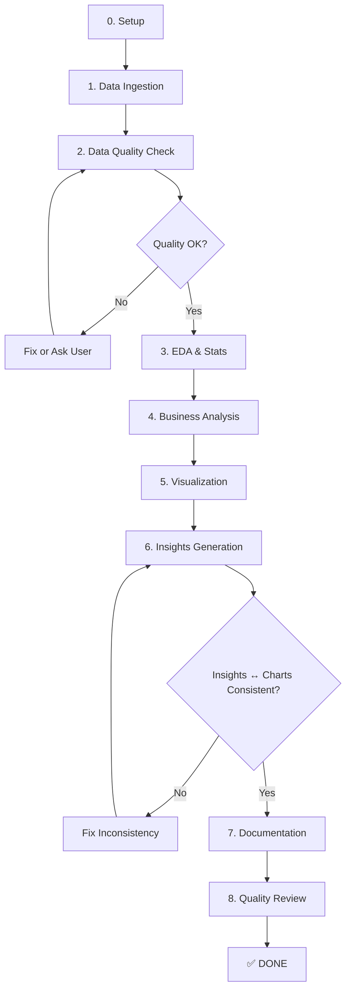

# Data Analytics Workflow - Agent Playbook

**Version**: 1.1.0
**Last Updated**: 2025-11-14
**Purpose**: Hướng dẫn Agent AI thực thi phân tích dữ liệu từ RAW DATA → INSIGHTS

**Changelog v1.1.0**:
- ✅ Added: Step 3.0 - Tạo Statics Module Structure
- ✅ Added: Step 3.1 - Tạo EDA Code Files (notebook + script)
- ✅ Added: Step 4.0 - Tạo Business Analysis Code Files (notebook + script)
- ✅ Enhanced: Project structure với statics module đầy đủ
- ✅ Enhanced: Success criteria bao gồm code editable requirements
- ✅ Emphasis: ALL code MUST be EDITABLE (có thể đọc hiểu, tinh chỉnh khi data thay đổi)

---

## 🎯 OVERVIEW

### Mục Đích
Playbook này định nghĩa **QUY TRÌNH CHUẨN** để phân tích dữ liệu từ nguồn thô (Excel, CSV, JSON, PDF) cho đến kết quả cuối cùng (Charts, Insights, Documentation).

**QUAN TRỌNG**: Workflow này LUÔN tạo code EDITABLE (notebook + script) để user có thể:
- Đọc hiểu logic và assumptions
- Tinh chỉnh parameters khi data thay đổi
- Reuse cho projects tương tự
- Maintain và scale khi cần

### Scope
- ✅ Data loading & validation
- ✅ **Exploratory Data Analysis (EDA)** - Tạo statics module đầy đủ
- ✅ **Descriptive statistics** - CV, outliers, correlation, distribution
- ✅ **Business metrics analysis** - Tạo analysis code editable
- ✅ Visualization (7 EDA charts + 3-5 business charts)
- ✅ Insights generation (10,000+ words, comprehensive)
- ✅ Documentation (README cho statics module)
- ✅ **Code Quality** - Tiếng Việt, comments rõ ràng, có thể đọc hiểu
- ❌ NOT included: Machine Learning, Predictive Modeling

### Prerequisites
```bash
# Dependencies
pandas >= 1.3.0
numpy >= 1.21.0
matplotlib >= 3.4.0
seaborn >= 0.11.0
scipy >= 1.7.0
openpyxl >= 3.0.0  # for Excel
```

### Success Criteria
- [ ] Data validated (no critical errors)
- [ ] **Statics module created** (`statics/code/eda.ipynb` + `generate_charts.py` + README)
- [ ] **Business code created** (`code/analysis.py` + `analysis.ipynb`)
- [ ] EDA completed (7 charts generated in `statics/charts_eda/`)
- [ ] Business analysis done (metrics calculated, saved to `document/metrics.json`)
- [ ] Business charts created (3-5 targeted charts in `charts/`)
- [ ] Insights documented (`document/insights.md`, 10,000+ words)
- [ ] Charts & stats match insights (CONSISTENCY validated)
- [ ] **All code is EDITABLE** (có thể đọc hiểu và tinh chỉnh khi data thay đổi)

---

## 📂 PROJECT STRUCTURE

Khi bắt đầu project mới, tạo cấu trúc:

```
[project_name]/
├── code/
│   ├── analysis.py              # ⭐ Business metrics (script version)
│   └── analysis.ipynb           # ⭐ Business metrics (notebook version - EDITABLE)
├── charts/                      # Business-specific charts
│   ├── 01_[chart_name].png
│   ├── 02_[chart_name].png
│   └── ...
├── document/
│   ├── insights.md              # ⭐ INSIGHTS CHÍNH (11,000+ words)
│   ├── metrics.json             # Business metrics output
│   ├── summary_by_year.csv      # Summary stats
│   └── README.md                # Project overview
└── statics/                     # ⭐ EDA Module (FULL STATISTICS)
    ├── code/
    │   ├── eda.ipynb            # ⭐ EDA notebook (EDITABLE)
    │   └── generate_charts.py   # ⭐ Chart generator (script)
    ├── charts_eda/              # 7 standard EDA charts
    │   ├── 01_boxplot_revenue_by_year.png
    │   ├── 02_histogram_revenue_distribution.png
    │   ├── 03_correlation_heatmap.png
    │   ├── 04_violin_revenue_by_year.png
    │   ├── 05_timeseries_monthly_trend.png
    │   ├── 06_cv_comparison_by_year.png
    │   └── 07_statistics_summary_table.png
    ├── document/
    │   └── eda_statistics.csv   # Stats export from EDA
    └── README.md                # Documentation for statics module
```

**Key Points**:
- **`code/`**: Business analysis code (BOTH .py script và .ipynb notebook)
- **`statics/`**: Phần thống kê EDA đầy đủ (BOTH notebook và script)
- **`charts/`**: Business charts (3-5 charts targeted)
- **`charts_eda/`**: Statistical charts (7 standard EDA charts)
- **All code MUST be EDITABLE** (có thể đọc hiểu, tinh chỉnh khi data thay đổi)

**Lưu ý**:
- Thư mục `[project_name]` sẽ khác nhau mỗi project (vd: "plan 2026", "2025 11 blvp analysis")
- LUÔN tạo CẢ notebook (.ipynb) VÀ script (.py) để linh hoạt sử dụng

---

## 🔄 WORKFLOW OVERVIEW



---

## 📋 DETAILED WORKFLOW

---

## PHASE 0: Setup & Understanding

### Step 0.1: Read User Input
**Mục đích**: Hiểu requirements và context

**Actions**:
1. User kéo file vào hoặc cung cấp path
2. User giải thích vài câu về dữ liệu
3. Agent hỏi làm rõ nếu cần

**Questions Agent Nên Hỏi**:
```
1. Mục đích phân tích?
   - So sánh periods (2025 vs 2026)?
   - Tìm growth drivers?
   - Identify risks?
   - Other?

2. Output mong muốn?
   - Charts only?
   - Insights + charts?
   - Full analysis package?

3. Business context?
   - Financial? Marketing? Operations?
   - Key metrics quan tâm?
   - Thresholds/targets?
```

**Decision Point**:
```
IF user unclear → Ask 2-3 clarifying questions MAX
IF user very clear → Proceed to Phase 1
```

### Step 0.2: Create Project Structure
**Actions**:
```bash
mkdir -p [project_name]/{code,charts,document,statics/{code,charts,document}}
```

**Logging**:
```
✅ Created project structure at: [path]
```

---

## PHASE 1: Data Ingestion

### Step 1.1: Load Raw Data

**Supported Formats**:
- Excel: `.xlsx`, `.xls`
- CSV: `.csv`
- JSON: `.json`
- PDF: `.pdf` (extract tables)

**Code Template**:
```python
import pandas as pd

def load_data(file_path, file_type='auto'):
    """
    Load data with auto-detection
    """
    if file_type == 'auto':
        file_type = file_path.split('.')[-1].lower()

    if file_type in ['xlsx', 'xls']:
        # Excel: Load all sheets
        dfs = pd.read_excel(file_path, sheet_name=None)
        print(f"✅ Loaded {len(dfs)} sheets: {list(dfs.keys())}")
        return dfs

    elif file_type == 'csv':
        df = pd.read_csv(file_path)
        print(f"✅ Loaded CSV: {df.shape}")
        return {'data': df}

    elif file_type == 'json':
        df = pd.read_json(file_path)
        print(f"✅ Loaded JSON: {df.shape}")
        return {'data': df}

    else:
        raise ValueError(f"Unsupported file type: {file_type}")
```

**Validation**:
```python
# Check if loaded successfully
assert dfs is not None, "❌ Failed to load data"
assert len(dfs) > 0, "❌ No data found"

# Log summary
for sheet_name, df in dfs.items():
    print(f"  {sheet_name}: {df.shape[0]} rows × {df.shape[1]} cols")
```

**Decision Point**:
```
IF Excel with multiple sheets:
  → Ask user: "Which sheet(s) to analyze?"
  OR auto-detect main data sheet (largest one)

IF CSV/JSON single file:
  → Proceed

IF load fails:
  → Try different encoding (utf-8, latin1, cp1252)
  → If still fails → Ask user
```

### Step 1.2: Initial Data Inspection

**Actions**:
```python
# For each dataframe
for name, df in dfs.items():
    print(f"\n=== {name} ===")
    print(f"Shape: {df.shape}")
    print(f"Columns: {list(df.columns)}")
    print(f"\nFirst 3 rows:\n{df.head(3)}")
    print(f"\nData types:\n{df.dtypes}")
```

**Logging**:
```
✅ Inspected data: [sheet_name]
   - Rows: N
   - Columns: M
   - Preview: OK
```

---

## PHASE 2: Data Quality Check

### Step 2.1: Schema Validation

**Check Structure**:
```python
def validate_schema(df, expected_cols=None):
    """
    Validate data structure
    """
    issues = []

    # Check if empty
    if df.empty:
        issues.append("❌ DataFrame is empty")

    # Check columns
    if expected_cols:
        missing = set(expected_cols) - set(df.columns)
        if missing:
            issues.append(f"❌ Missing columns: {missing}")

    # Check duplicates
    dup_count = df.duplicated().sum()
    if dup_count > 0:
        issues.append(f"⚠️ {dup_count} duplicate rows found")

    return issues
```

**Decision Point**:
```
IF critical issues (empty, missing key columns):
  → STOP → Ask user

IF warnings only (duplicates, unexpected columns):
  → LOG warning → Continue
```

### Step 2.2: Data Quality Metrics

**Calculate**:
```python
def data_quality_report(df):
    """
    Generate data quality report
    """
    report = {
        'total_rows': len(df),
        'total_cols': len(df.columns),
        'missing_values': df.isnull().sum().to_dict(),
        'missing_pct': (df.isnull().sum() / len(df) * 100).round(2).to_dict(),
        'duplicates': df.duplicated().sum(),
        'dtypes': df.dtypes.to_dict()
    }

    # Flag issues
    report['critical_issues'] = []
    report['warnings'] = []

    for col, pct in report['missing_pct'].items():
        if pct > 50:
            report['critical_issues'].append(f"{col}: {pct}% missing")
        elif pct > 10:
            report['warnings'].append(f"{col}: {pct}% missing")

    return report
```

**Validation Gate**:
```
IF critical_issues:
  → STOP
  → Report to user
  → Ask: "Fix data or proceed with caution?"

IF warnings only:
  → LOG warnings
  → Proceed
```

### Step 2.3: Data Cleaning

**Auto-Fix (Safe operations)**:
```python
def auto_clean(df, revenue_cols):
    """
    Safe auto-cleaning
    """
    df_clean = df.copy()

    # 1. Fill missing numeric values with 0 (for revenue columns)
    for col in revenue_cols:
        if col in df_clean.columns:
            df_clean[col] = df_clean[col].fillna(0)
            print(f"  ✅ Filled {col} missing values with 0")

    # 2. Remove duplicate rows (if any)
    before = len(df_clean)
    df_clean = df_clean.drop_duplicates()
    after = len(df_clean)
    if before > after:
        print(f"  ✅ Removed {before - after} duplicate rows")

    # 3. Fix data types (if needed)
    # ... type conversions

    return df_clean
```

**Logging**:
```
✅ Data cleaned
   - Missing values filled: [columns]
   - Duplicates removed: N
   - Type conversions: [if any]
```

---

## PHASE 3: EDA & Descriptive Statistics

**CRITICAL**: Tạo STATICS MODULE ĐẦY ĐỦ để có thể đọc hiểu, tinh chỉnh khi data thay đổi

### Step 3.0: Tạo Statics Module Structure

**Mục đích**: Tạo code có thể edit, reuse, maintain khi data thay đổi

**Actions**:
```bash
# Tạo folder structure
mkdir -p "[project_name]/statics/code"
mkdir -p "[project_name]/statics/document"
mkdir -p "[project_name]/statics/charts"
# hoặc charts_eda tuỳ project
```

**Output**: Cấu trúc sẵn sàng cho EDA code

### Step 3.1: Tạo EDA Code Files (EDITABLE)

**QUAN TRỌNG**: Tạo CẢ 2 versions - notebook (interactive) và script (automated)

**File 1: `statics/code/eda.ipynb`** (Interactive Jupyter Notebook)

**Sections bắt buộc**:
1. Setup & Imports
2. Load Data
3. Data Quality Check
4. Clean Data
5. Descriptive Statistics (mean, median, std, quartiles)
6. Distribution Analysis (skewness, kurtosis)
7. Outlier Detection (IQR method)
8. Coefficient of Variation (CV) - QUAN TRỌNG
9. Correlation Analysis
10. Time Series Analysis
11. Export Summary Statistics
12. Key Findings Summary

**Template Code**:
```python
# Cell 1: Setup
import pandas as pd
import numpy as np
import matplotlib.pyplot as plt
import seaborn as sns
from pathlib import Path
from scipy import stats

# Design settings
plt.rcParams['figure.dpi'] = 300
plt.rcParams['font.size'] = 10
COLORS = {
    'primary': '#000000',
    'secondary': '#4A4A4A',
    'tertiary': '#808080',
    'light': '#B0B0B0'
}

# Cell 2: Load Data
BASE_DIR = Path.cwd().parent.parent.parent.parent.parent
DATA_FILE = BASE_DIR / "path/to/data.xlsx"
df = pd.read_excel(DATA_FILE)

# Cell 3-11: [Full EDA analysis sections...]

# Cell 12: Export
stats_summary.to_csv(OUTPUT_DIR / "eda_statistics.csv", index=False)
print("✅ EDA completed")
```

**File 2: `statics/code/generate_charts.py`** (Automated Chart Generation)

**Mục đích**: Generate 7 standard EDA charts tự động

**7 Charts bắt buộc**:
1. `01_boxplot_revenue_by_year.png` - Outliers & distribution
2. `02_histogram_revenue_distribution.png` - Overall distribution
3. `03_correlation_heatmap.png` - Variable relationships
4. `04_violin_revenue_by_year.png` - Distribution shape
5. `05_timeseries_monthly_trend.png` - Time patterns
6. `06_cv_comparison_by_year.png` - Variability analysis
7. `07_statistics_summary_table.png` - Stats table as image

**Template Code**:
```python
"""
Generate 7 Standard EDA Charts
Following WORKFLOW_ANALYTICS.md design principles
"""
import pandas as pd
import matplotlib.pyplot as plt
from pathlib import Path

# Setup
BASE_DIR = Path(__file__).parent.parent.parent.parent.parent
DATA_FILE = BASE_DIR / "path/to/data.xlsx"
CHARTS_DIR = Path(__file__).parent.parent / "charts_eda"
CHARTS_DIR.mkdir(exist_ok=True)

# Load & Clean
df = pd.read_excel(DATA_FILE)
df['doanh thu'] = df['doanh thu'].fillna(0)

# Chart 1: Boxplot
fig, ax = plt.subplots(figsize=(10, 6))
# ... [plotting code]
plt.savefig(CHARTS_DIR / "01_boxplot_revenue_by_year.png", dpi=300)

# ... [Charts 2-7]

print("✅ All 7 EDA charts generated")
```

**File 3: `statics/README.md`** (Documentation)

**Nội dung bắt buộc**:
- Purpose của module
- Quick start guide (how to run notebook và script)
- List of charts generated
- Key statistics explained
- Customization options
- Integration với business analysis
- Troubleshooting tips

**KHÔNG DÙNG EMOJI, KHÔNG ICON** (theo AGENTS.md)

### Step 3.2: Run EDA Analysis

**Option A: Interactive** (khi cần explore và tinh chỉnh)
```bash
cd "[project_name]/statics/code"
jupyter notebook eda.ipynb
# Execute all cells manually
```

**Option B: Automated** (khi data structure đã clear)
```bash
cd "[project_name]/statics/code"
python generate_charts.py
```

**Validation**:
```python
# Check outputs
import os

expected_charts = [
    '01_boxplot_revenue_by_year.png',
    '02_histogram_revenue_distribution.png',
    '03_correlation_heatmap.png',
    '04_violin_revenue_by_year.png',
    '05_timeseries_monthly_trend.png',
    '06_cv_comparison_by_year.png',
    '07_statistics_summary_table.png'
]

charts_dir = 'statics/charts_eda'  # or 'statics/charts'
missing = []
for chart in expected_charts:
    path = f'{charts_dir}/{chart}'
    if not os.path.exists(path):
        missing.append(chart)

if missing:
    print(f"❌ Missing charts: {missing}")
else:
    print("✅ All 7 EDA charts generated")

# Check stats CSV
stats_file = 'statics/document/eda_statistics.csv'
if os.path.exists(stats_file):
    print(f"✅ Stats CSV exists: {stats_file}")
else:
    print(f"⚠️  Stats CSV not found: {stats_file}")
```

### Step 3.3: Analyze EDA Results

**Key Metrics to Extract**:
```python
# From stats CSV
stats_2025 = pd.read_csv('statics/document/csv/stats_2025.csv', index_col=0)
stats_2026 = pd.read_csv('statics/document/csv/stats_2026.csv', index_col=0)
cv = pd.read_csv('statics/document/csv/coefficient_of_variation.csv', index_col=0)

# Identify patterns
high_cv_channels = cv[cv['CV 2025 (%)'] > 50].index.tolist()
stable_channels = cv[cv['CV 2025 (%)'] < 20].index.tolist()

print(f"High CV (>50%): {high_cv_channels}")
print(f"Stable (<20%): {stable_channels}")
```

**Decision Tree**:
```
FOR each channel:
  IF CV > 50%:
    → Mark as "High Risk"
    → Forecast method: Use MEDIAN + separate peak months
    → Buffer: 30%+

  ELIF CV 20-50%:
    → Mark as "Medium Risk"
    → Forecast method: MEAN with monthly monitoring
    → Buffer: 15-20%

  ELSE (CV < 20%):
    → Mark as "Stable"
    → Forecast method: MEAN
    → Buffer: 5-10%
```

**Store Decisions**:
```python
# Save for later use in insights
eda_insights = {
    'high_risk_channels': high_cv_channels,
    'stable_channels': stable_channels,
    'outlier_months': {},  # From boxplots
    'correlations': {},     # From heatmap
    'seasonality': {}       # From time series
}

# Export
import json
with open('statics/document/eda_insights.json', 'w') as f:
    json.dump(eda_insights, f, indent=2)
```

---

## PHASE 4: Business Analysis

**CRITICAL**: Tạo CODE EDITABLE cho business metrics để có thể tinh chỉnh khi yêu cầu thay đổi

### Step 4.0: Tạo Business Analysis Code Files

**QUAN TRỌNG**: Tạo CẢ 2 versions - notebook (interactive) và script (automated)

**File 1: `code/analysis.ipynb`** (Interactive Jupyter Notebook)

**Mục đích**:
- Tính toán business metrics có thể chỉnh sửa
- Interactive để test scenarios khác nhau
- Dễ dàng thay đổi assumptions và re-run

**Sections bắt buộc**:
1. Setup (imports, paths)
2. Load & Clean Data
3. Data Quality Check
4. Extract specific data (vd: Bảo Việt, top companies)
5. Calculate Key Metrics (revenue by year, percentages, etc.)
6. Calculate Growth Rates
7. Scenario Analysis (multiple scenarios: accept, refuse, negotiate)
8. Cost Analysis
9. Summary Statistics
10. Top N Analysis (companies, channels, etc.)
11. Save Metrics (JSON, CSV)
12. Key Findings & Recommendation

**Template Code**:
```python
# Cell 1: Setup
import pandas as pd
import numpy as np
import json
from pathlib import Path

BASE_DIR = Path.cwd().parent
DATA_FILE = BASE_DIR.parent.parent.parent / "path/to/data.xlsx"
OUTPUT_DIR = BASE_DIR / "document"
OUTPUT_DIR.mkdir(exist_ok=True)

# Cell 2-11: [Business analysis sections...]

# Cell 12: Summary
print("="*60)
print("ANALYSIS COMPLETE")
print("="*60)
print(f"\nKey finding: [...]")
print(f"\nRecommendation: [...]")
```

**File 2: `code/analysis.py`** (Script Version)

**Mục đích**:
- Automated execution
- Reproducible analysis
- Can be scheduled or run in CI/CD

**Template Code**:
```python
"""
Business Analysis Script
Tính toán metrics và generate insights
"""
import pandas as pd
import numpy as np
import json
from pathlib import Path

# =============================================================================
# SETUP
# =============================================================================

BASE_DIR = Path(__file__).parent.parent
DATA_FILE = BASE_DIR.parent.parent.parent / "path/to/data.xlsx"
OUTPUT_DIR = BASE_DIR / "document"
OUTPUT_DIR.mkdir(exist_ok=True)

print("=== BUSINESS ANALYSIS ===\n")

# =============================================================================
# 1. LOAD & CLEAN DATA
# =============================================================================

print("1. Loading data...")
df = pd.read_excel(DATA_FILE)
df['doanh thu'] = df['doanh thu'].fillna(0)
print(f"   Loaded: {len(df)} records")

# =============================================================================
# 2-10. [Business analysis sections...]
# =============================================================================

# ... [all metrics calculations]

# =============================================================================
# 11. SAVE METRICS
# =============================================================================

print("\n11. Saving metrics...")
output_file = OUTPUT_DIR / "metrics.json"
with open(output_file, 'w', encoding='utf-8') as f:
    json.dump(metrics, f, indent=2, ensure_ascii=False)
print(f"   ✅ Saved: {output_file}")

# =============================================================================
# 12. SUMMARY
# =============================================================================

print("\n" + "="*60)
print("✅ ANALYSIS COMPLETE")
print("="*60)
print(f"\nKey finding: [...]")
print(f"\nRecommendation: [...]")
print("="*60)
```

**Lưu ý**:
- Code phải có comment tiếng Việt rõ ràng
- Section headers rõ ràng với `# =============`
- Print progress để user biết đang ở đâu
- Tất cả paths dùng `Path()` object (cross-platform)

### Step 4.1: Calculate Business Metrics

**Common Metrics** (adjust based on context):

```python
def calculate_business_metrics(df_2025, df_2026, revenue_cols):
    """
    Calculate key business metrics
    """
    metrics = {}

    # 1. Growth Rate
    metrics['growth_rate'] = {}
    for col in revenue_cols:
        growth = ((df_2026[col].sum() / df_2025[col].sum()) - 1) * 100
        metrics['growth_rate'][col] = round(growth, 2)

    # 2. Growth Contribution (KEY METRIC!)
    df_contrib = pd.DataFrame({'Thang': df_2026['thang']})
    for col in revenue_cols:
        delta_kenh = df_2026[col].values - df_2025[col].values
        delta_tong = df_2026['TONG'].values - df_2025['TONG'].values
        df_contrib[col] = (delta_kenh / delta_tong * 100).round(1)

    metrics['growth_contribution'] = df_contrib[revenue_cols].mean().to_dict()

    # 3. Market Share (tỉ trọng)
    metrics['market_share_2025'] = (df_2025[revenue_cols].sum() / df_2025['TONG'].sum() * 100).round(2).to_dict()
    metrics['market_share_2026'] = (df_2026[revenue_cols].sum() / df_2026['TONG'].sum() * 100).round(2).to_dict()

    # 4. Peak Months (từ EDA)
    metrics['peak_months'] = {}
    for col in revenue_cols:
        peak_month = df_2026[col].idxmax() + 1  # +1 vì index từ 0
        metrics['peak_months'][col] = int(df_2026.loc[df_2026[col].idxmax(), 'thang'])

    return metrics
```

**Store Results**:
```python
# Save metrics
with open('document/business_metrics.json', 'w') as f:
    json.dump(metrics, f, indent=2)

print("✅ Business metrics calculated and saved")
```

### Step 4.2: Identify Key Insights

**Template**:
```python
def extract_insights(metrics, eda_insights):
    """
    Extract actionable insights
    """
    insights = []

    # 1. Growth Drivers
    growth_contrib = metrics['growth_contribution']
    top_driver = max(growth_contrib, key=growth_contrib.get)
    insights.append({
        'type': 'growth_driver',
        'title': f"{top_driver} là động cơ tăng trưởng chính",
        'data': f"{growth_contrib[top_driver]:.1f}% đóng góp",
        'action': f"Focus resources vào {top_driver}"
    })

    # 2. Risk Channels (từ EDA)
    for channel in eda_insights['high_risk_channels']:
        insights.append({
            'type': 'risk',
            'title': f"{channel} biến động cao (CV > 50%)",
            'data': f"Khó dự đoán, cần buffer lớn",
            'action': f"Forecast riêng từng tháng cho {channel}, buffer 30%+"
        })

    # 3. Seasonality
    for channel, peak_month in metrics['peak_months'].items():
        if peak_month in [1, 6, 7, 8, 9]:  # Known seasonal months
            insights.append({
                'type': 'seasonality',
                'title': f"{channel} đỉnh tháng {peak_month}",
                'data': f"Cần chuẩn bị trước 2-3 tháng",
                'action': f"Reserve budget & resources từ tháng {peak_month - 2}"
            })

    # 4. Cross-sell Opportunities (từ correlation)
    # ... (nếu có correlation cao)

    return insights
```

---

## PHASE 5: Visualization

### Step 5.1: Generate Analysis Charts

**Beyond EDA charts**, tạo business-specific charts:

```python
# Example: Growth contribution chart
def create_growth_contribution_chart(df_contrib, output_path):
    """
    Visualize growth contribution by channel
    """
    fig, ax = plt.subplots(figsize=(12, 6))

    df_contrib[revenue_cols].plot(kind='bar', ax=ax,
                                   color=['#000000', '#404040', '#808080', '#C0C0C0', '#F5F5F5'],
                                   edgecolor='black', linewidth=1)

    ax.set_title('Growth Contribution by Channel', fontsize=14, fontweight='bold')
    ax.set_xlabel('Tháng', fontsize=11)
    ax.set_ylabel('Đóng góp (%)', fontsize=11)
    ax.legend(title='Kênh', fontsize=9)
    ax.grid(axis='y', alpha=0.3, linestyle='--')
    ax.axhline(0, color='black', linewidth=0.8)

    plt.tight_layout()
    plt.savefig(output_path, dpi=300, bbox_inches='tight', facecolor='white')
    plt.close()

    print(f"✅ Saved: {output_path}")
```

**Chart List** (based on project type):
- Growth contribution (bar chart)
- YoY comparison (line chart)
- Market share evolution (area chart)
- Budget vs Revenue (scatter plot)
- ... (custom based on needs)

### Step 5.2: Validate Chart Quality

**Checklist**:
```python
def validate_charts(chart_dir):
    """
    Validate generated charts
    """
    issues = []

    # Check all charts exist
    for chart_file in os.listdir(chart_dir):
        if not chart_file.endswith('.png'):
            continue

        path = os.path.join(chart_dir, chart_file)

        # Check file size (not too small = likely error)
        size_kb = os.path.getsize(path) / 1024
        if size_kb < 10:
            issues.append(f"⚠️ {chart_file} too small ({size_kb:.1f} KB)")

        # Check resolution (should be 300 DPI)
        # (would need PIL/Pillow to check)

    if issues:
        print("⚠️ Chart validation issues:")
        for issue in issues:
            print(f"  {issue}")
    else:
        print("✅ All charts validated")

    return len(issues) == 0
```

---

## PHASE 6: Insights Generation

### Step 6.1: Draft Insights Document

**CRITICAL**: Insights PHẢI đồng nhất với charts và stats!

**Template Structure**:
```markdown
# [Project Name] - Insights

**Ngày phân tích**: [Date]
**Trạng thái**: [Draft/Review/Final]

---

## 📊 TÓM TẮT ĐIỀU HÀNH

### Phát Hiện Quan Trọng
[Top 3-5 key findings từ data]

### Hành Động Ưu Tiên
[Immediate actions needed]

---

## 1. TỔNG QUAN DỮ LIỆU

[From Phase 2 - Data Quality]

---

## 2. THỐNG KÊ MÔ TẢ

[From Phase 3 - EDA]

### 2.1 Hệ Số Biến Động (CV)
[Chart: 06_cv_comparison.png]
[Data: coefficient_of_variation.csv]

**Insights**:
- [Channel A] CV = X% → [Stable/Risky]
- [Channel B] CV = Y% → [Stable/Risky]

**Action**:
- [Specific action based on CV]

### 2.2 Phân Phối & Outliers
[Chart: 01_boxplots_outliers.png, 02_histograms_distribution.png]

**Insights**:
- [Tháng nào có outliers? Tại sao?]

---

## 3. PHÂN TÍCH KINH DOANH

[From Phase 4 - Business Analysis]

### 3.1 Động Cơ Tăng Trưởng
[Chart: growth_contribution.png]
[Data: business_metrics.json → growth_contribution]

**Insights**:
- [Top channel]: X% đóng góp
- [Giải thích tại sao]

**Action**:
- [Focus resources, budget allocation]

### 3.2 Seasonality Patterns
[Chart: 05_timeseries_confidence.png]

**Insights**:
- [Channel A] đỉnh tháng [M]
- Lead time: [N] tháng

**Action**:
- Chuẩn bị từ tháng [M-N]

---

## 4. ĐỀ XUẤT HÀNH ĐỘNG

### 4.1 Immediate (Q4/[Year])
1. ✅ [Action 1]
2. ✅ [Action 2]

### 4.2 Short-term (Q1-Q2/[Year+1])
...

### 4.3 Long-term
...

---

## 5. RỦI RO & GIẢM THIỂU

[Identify risks from high CV channels, correlations, etc.]

---

## 6. KẾT LUẬN

[Summary + next steps]
```

**Code to Generate**:
```python
def generate_insights_md(metrics, eda_insights, insights_list, output_path):
    """
    Auto-generate insights.md from data
    """
    # Read template
    # Fill in data
    # Cross-reference charts and CSV
    # Ensure consistency

    # Example snippet
    content = f"""
# {project_name} - Insights

## Growth Drivers

{insights_list[0]['title']}
- Đóng góp: {insights_list[0]['data']}
- Action: {insights_list[0]['action']}

*Refer to: charts/growth_contribution.png*
*Data source: business_metrics.json → growth_contribution*
"""

    with open(output_path, 'w', encoding='utf-8') as f:
        f.write(content)
```

### Step 6.2: Cross-Validate Insights ↔ Charts

**CRITICAL VALIDATION**:
```python
def validate_insights_consistency(insights_md_path, charts_dir, data_dir):
    """
    Ensure insights match charts and data
    """
    issues = []

    # Read insights.md
    with open(insights_md_path, 'r', encoding='utf-8') as f:
        insights_text = f.read()

    # Check 1: All referenced charts exist
    import re
    chart_refs = re.findall(r'charts/([a-zA-Z0-9_.-]+\.png)', insights_text)
    for chart in chart_refs:
        if not os.path.exists(os.path.join(charts_dir, chart)):
            issues.append(f"❌ Referenced chart not found: {chart}")

    # Check 2: Numbers in insights match data
    # (more complex - would need to parse metrics from text and compare)

    # Check 3: Insights cover all key findings
    # (check if high CV channels are mentioned, etc.)

    if issues:
        print("❌ Inconsistencies found:")
        for issue in issues:
            print(f"  {issue}")
        return False
    else:
        print("✅ Insights ↔ Charts ↔ Data: CONSISTENT")
        return True
```

**Decision Point**:
```
IF inconsistent:
  → Fix insights OR regenerate charts
  → Re-validate
  → Loop until consistent

ELSE:
  → Proceed to documentation
```

---

## PHASE 7: Documentation

### Step 7.1: Generate README

**Template**: `[project_name]/README.md`

```markdown
# [Project Name] - Analysis Package

**Ngày tạo**: [Date]
**Trạng thái**: ✅ HOÀN THÀNH

---

## 📦 Sản Phẩm

1. **Insights** (⭐ CHÍNH)
   - File: `document/insights.md`
   - Nội dung: [Summary]

2. **Charts**
   - Thư mục: `charts/`
   - [N] biểu đồ (300 DPI, PNG)

3. **Statistics**
   - Thư mục: `document/csv/`
   - Descriptive stats, correlation, metrics

4. **Code**
   - Jupyter notebooks: `code/*.ipynb`
   - Scripts: `code/*.py`

---

## 🚀 Cách Sử Dụng

### Quick Start
\`\`\`bash
# Xem insights
code document/insights.md

# Xem charts
explorer charts/

# Chạy lại analysis
jupyter notebook code/analyst.ipynb
\`\`\`

---

## 📊 Key Findings

[Top 3-5 findings từ insights.md]

---

## 📝 Files

\`\`\`
[Cấu trúc thư mục]
\`\`\`
```

### Step 7.2: Generate Guide (Optional)

Copy `huong_dan_doc_bieu_do.md` template nếu cần.

---

## PHASE 8: Quality Review

### Step 8.1: Final Checklist

```python
def final_quality_check(project_dir):
    """
    Comprehensive quality check before delivery
    """
    checks = {
        'Data Quality': False,
        'EDA Completed': False,
        'Business Metrics': False,
        'Charts Generated': False,
        'Insights Written': False,
        'Consistency Validated': False,
        'Documentation Done': False
    }

    # Check 1: Data Quality
    if os.path.exists(f'{project_dir}/statics/document/csv/stats_2025.csv'):
        checks['Data Quality'] = True

    # Check 2: EDA
    eda_charts = [f'{project_dir}/statics/charts/{i:02d}_*.png' for i in range(1, 8)]
    if all(glob.glob(pattern) for pattern in eda_charts):
        checks['EDA Completed'] = True

    # Check 3: Business Metrics
    if os.path.exists(f'{project_dir}/document/business_metrics.json'):
        checks['Business Metrics'] = True

    # Check 4: Charts
    if len(os.listdir(f'{project_dir}/charts/')) >= 5:  # At least 5 charts
        checks['Charts Generated'] = True

    # Check 5: Insights
    if os.path.exists(f'{project_dir}/document/insights.md'):
        # Check if not empty
        size = os.path.getsize(f'{project_dir}/document/insights.md')
        if size > 1000:  # At least 1KB
            checks['Insights Written'] = True

    # Check 6: Consistency (run validation function)
    checks['Consistency Validated'] = validate_insights_consistency(...)

    # Check 7: Documentation
    if os.path.exists(f'{project_dir}/README.md'):
        checks['Documentation Done'] = True

    # Report
    print("\n" + "="*60)
    print("QUALITY REVIEW")
    print("="*60)
    for check, passed in checks.items():
        status = "✅" if passed else "❌"
        print(f"{status} {check}")

    all_passed = all(checks.values())
    if all_passed:
        print("\n🎉 ALL CHECKS PASSED - READY FOR DELIVERY")
    else:
        failed = [k for k, v in checks.items() if not v]
        print(f"\n⚠️ FAILED CHECKS: {', '.join(failed)}")

    return all_passed
```

### Step 8.2: Human Review (Optional)

**Ask User**:
```
✅ Analysis completed!

Summary:
- [N] charts generated
- [M] key insights identified
- Top finding: [X]

Would you like to:
1. Review insights.md
2. Review charts
3. Make adjustments
4. Approve and finalize
```

---

## 🚨 ERROR HANDLING

### Common Errors & Solutions

#### Error 1: Data Load Failed
```
Symptoms: pd.read_excel() fails
Causes:
  - File not found
  - Corrupted file
  - Wrong encoding

Solutions:
1. Check file path exists
2. Try different encodings
3. Ask user for correct file
```

#### Error 2: Missing Values > 50%
```
Symptoms: validation_report shows high missing %
Causes:
  - Incomplete data
  - Wrong sheet selected

Solutions:
1. Ask user: "Is this expected?"
2. If yes: Proceed with caution
3. If no: Request complete data
```

#### Error 3: Charts Not Generated
```
Symptoms: generate_charts.py fails
Causes:
  - Missing dependencies
  - Data shape mismatch
  - Memory error

Solutions:
1. Check dependencies installed
2. Validate data shape
3. Reduce chart complexity
```

#### Error 4: Inconsistent Insights
```
Symptoms: validate_insights_consistency() fails
Causes:
  - Manual edits to insights.md
  - Charts regenerated but insights not updated

Solutions:
1. Identify mismatch
2. Regenerate insights from data
3. Re-validate
```

### Logging & Debugging

**Log Levels**:
```python
import logging

# Setup
logging.basicConfig(
    level=logging.INFO,
    format='%(asctime)s - %(levelname)s - %(message)s',
    handlers=[
        logging.FileHandler(f'{project_dir}/workflow.log'),
        logging.StreamHandler()
    ]
)

# Usage
logging.info("✅ Data loaded successfully")
logging.warning("⚠️ High missing values in column X")
logging.error("❌ Chart generation failed")
logging.debug("🔍 DataFrame shape: (24, 10)")
```

**Checkpoint System**:
```python
# Save progress after each phase
checkpoints = {
    'phase_0_setup': False,
    'phase_1_ingestion': False,
    'phase_2_quality': False,
    'phase_3_eda': False,
    'phase_4_analysis': False,
    'phase_5_visualization': False,
    'phase_6_insights': False,
    'phase_7_documentation': False
}

def save_checkpoint(phase, status=True):
    checkpoints[phase] = status
    with open(f'{project_dir}/.checkpoints.json', 'w') as f:
        json.dump(checkpoints, f)

# Resume from checkpoint
def resume_from_checkpoint():
    if os.path.exists(f'{project_dir}/.checkpoints.json'):
        with open(f'{project_dir}/.checkpoints.json') as f:
            return json.load(f)
    return checkpoints
```

---

## 🎓 DECISION TREES

### Tree 1: Forecast Method Selection

```
FOR each channel:
  READ CV from coefficient_of_variation.csv

  IF CV < 20%:
    forecast_method = "MEAN"
    buffer = "5-10%"
    monitoring = "Quarterly"
    confidence = "High"

  ELIF CV >= 20% AND CV < 50%:
    forecast_method = "MEAN with monthly monitoring"
    buffer = "15-20%"
    monitoring = "Monthly"
    confidence = "Medium"

  ELSE (CV >= 50%):
    READ distribution from histograms
    IF skewed:
      forecast_method = "MEDIAN + separate peak months"
    ELSE:
      forecast_method = "Custom per month"
    buffer = "30%+"
    monitoring = "Weekly during peak"
    confidence = "Low - needs custom approach"

  STORE decision for insights
```

### Tree 2: Validation Action

```
RUN data_quality_report()

IF critical_issues (empty data, missing key columns):
  STOP
  REPORT to user with details
  ASK: "Provide corrected data or skip this analysis?"
  WAIT for response

  IF user provides new data:
    RESTART from Phase 1
  ELSE:
    ABORT workflow

ELIF warnings (< 50% missing, duplicates):
  LOG warnings
  IF auto_fixable (duplicates, fillable NaN):
    AUTO_FIX
    LOG fixes applied
  ELSE:
    ASK user: "Continue with caution?"
    IF yes:
      CONTINUE
    ELSE:
      WAIT for user fix

ELSE (no issues):
  CONTINUE to next phase
```

### Tree 3: Chart Selection

```
IDENTIFY project_type from user input or auto-detect

IF project_type == "Financial":
  required_charts = [
    "Revenue trend (time series)",
    "YoY comparison",
    "Growth contribution",
    "Market share",
    "Budget vs Actual"
  ]

ELIF project_type == "Marketing":
  required_charts = [
    "Conversion funnel",
    "CAC trend",
    "LTV/CAC ratio",
    "Channel performance",
    "Campaign ROI"
  ]

ELIF project_type == "Operations":
  required_charts = [
    "Efficiency metrics",
    "Throughput over time",
    "Bottleneck analysis",
    "Resource utilization"
  ]

ELSE (unknown):
  ASK user: "What are the key metrics to visualize?"
  GENERATE custom charts based on response

ALWAYS include EDA charts (7 standard charts)
```

---

## 📚 CONFIGURATION

### workflow_config.yaml

Create this file to customize workflow:

```yaml
# Workflow Configuration
version: 1.0.0
project_name: "[Auto-filled or user-specified]"
project_type: "financial"  # financial, marketing, operations, custom

# Data Sources
data:
  primary_file: "excel/data.xlsx"
  file_type: "auto"  # auto-detect or specify
  expected_sheets:
    - "chi tieu"
    - "ngan sach"
    - "dinh bien"

# Analysis Settings
analysis:
  revenue_columns:  # Auto-detect or specify
    - "PACKAGE"
    - "CHC"
    - "REF"
    - "PHI"
    - "Digital"

  time_column: "thang"
  year_column: "nam"

  cv_thresholds:
    stable: 20
    medium: 50

  outlier_method: "iqr"  # iqr, zscore
  outlier_threshold: 1.5

# Visualization
visualization:
  design:
    colors:
      primary: "#000000"
      secondary: "#808080"
      light: "#F5F5F5"
      accent_blue: "#2962FF"
      accent_red: "#F23645"

    font_family: ["Calibri", "Arial"]
    font_size: 10
    dpi: 300

    no_pie_charts: true
    no_emojis: true
    no_icons: true

  chart_types:
    eda: "standard_7"  # Always generate 7 EDA charts
    business:
      - "growth_contribution"
      - "yoy_comparison"
      - "market_share"
      # Add custom charts

# Outputs
outputs:
  charts_format: "png"
  charts_dpi: 300
  stats_format: "csv"
  insights_format: "markdown"

  generate_readme: true
  generate_guide: false  # huong_dan_doc_bieu_do.md
  generate_presentation: false  # PowerPoint

# Validation
validation:
  strict_mode: false  # Stop on warnings?
  auto_fix: true      # Auto-fix safe issues?
  consistency_check: true

# Logging
logging:
  level: "INFO"  # DEBUG, INFO, WARNING, ERROR
  file: "workflow.log"
  console: true
```

---

## 🔗 INTEGRATION

### With Speckit

If using Speckit workflow:

```bash
# Create new analysis spec
/speckit.specify

# Template will ask:
# - Analysis objective
# - Data sources
# - Expected outputs

# Then auto-generate workflow based on this playbook
```

### With OpenSpec

For major changes to workflow:

```bash
# Propose workflow improvement
/openspec:proposal

# Example: Add ML prediction step
# → Goes through review → Approved → Integrated
```

---

## 📖 EXAMPLES

### Example 1: Plan 2026 Analysis (Current Project)

**Input**:
```
User: "Tao có file excel plan 2026, cần phân tích doanh thu 5 kênh so sánh 2025 vs 2026"
File: excel/total/plan 2026/data.xlsx
```

**Agent Execution**:
```
Phase 0: ✅ Understood - Financial analysis, 5 channels, YoY comparison
Phase 1: ✅ Loaded 5 sheets from Excel
Phase 2: ✅ Quality check passed (minor missing values auto-filled)
Phase 3: ✅ EDA completed - 7 charts generated
         - Key finding: REF CV = 60% (high risk)
Phase 4: ✅ Business metrics calculated
         - Growth contribution: REF 38%, PHI 27%
Phase 5: ✅ 12 analysis charts generated
Phase 6: ✅ Insights written (cross-validated with data)
Phase 7: ✅ Documentation complete
Phase 8: ✅ All quality checks passed

Output:
- 19 charts (7 EDA + 12 analysis)
- insights.md with 8 sections
- 5 CSV files with stats
- README.md
```

### Example 2: Marketing Campaign Analysis (Hypothetical)

**Input**:
```
User: "Phân tích hiệu quả campaigns Q3, có data conversion và CAC"
File: marketing_q3.csv
```

**Agent Execution**:
```
Phase 0: ✅ Detected: Marketing analysis
Phase 1: ✅ Loaded CSV (3000 rows)
Phase 2: ✅ Quality OK
Phase 3: ✅ EDA done - found high variance in CAC
Phase 4: ✅ Calculated: Conversion rate, CAC, LTV, ROI
         - Decision: Focus on Channel A (best ROI)
Phase 5: ✅ Charts: Funnel, CAC trend, ROI comparison
Phase 6: ✅ Insights: Recommend reallocate 30% budget to Channel A
Phase 7: ✅ Docs complete
Phase 8: ✅ Passed

Output:
- Actionable recommendation with data support
```

---

## 🎯 SUCCESS METRICS

### For Agent

**Efficiency**:
- [ ] Workflow completed in < 30 minutes (for typical dataset)
- [ ] < 3 user questions needed
- [ ] Zero manual interventions for standard cases

**Quality**:
- [ ] 100% consistency between insights ↔ charts ↔ data
- [ ] All validation checks passed
- [ ] Insights actionable (not just descriptive)

**Flexibility**:
- [ ] Works with different data formats (Excel, CSV, JSON)
- [ ] Adapts to different project types (Financial, Marketing, Ops)
- [ ] Handles edge cases gracefully

### For User

**Value**:
- [ ] Clear, actionable insights
- [ ] Professional charts ready for presentation
- [ ] Comprehensive documentation

**Usability**:
- [ ] Minimal input required from user
- [ ] Easy to understand outputs
- [ ] Can reproduce/modify analysis

---

## 🔄 VERSION HISTORY

**v1.0.0** (2025-11-14):
- Initial playbook
- Phases 0-8 defined
- Decision trees included
- Examples provided

**Future Enhancements**:
- [ ] Add ML prediction module (optional)
- [ ] PowerPoint auto-generation
- [ ] Interactive dashboard (HTML)
- [ ] API integration for live data
- [ ] Multi-language support

---

## 📞 SUPPORT

**For Agent Issues**:
- Check error handling section
- Review decision trees
- Validate configuration

**For User Questions**:
- Read examples section
- Check outputs in document/
- Review charts guide

---

**Tạo bởi**: Claude Code Assistant
**Ngày**: 2025-11-14
**Mục đích**: Standardize analytics workflow từ raw data → insights

🎉 **Chúc phân tích hiệu quả!**
