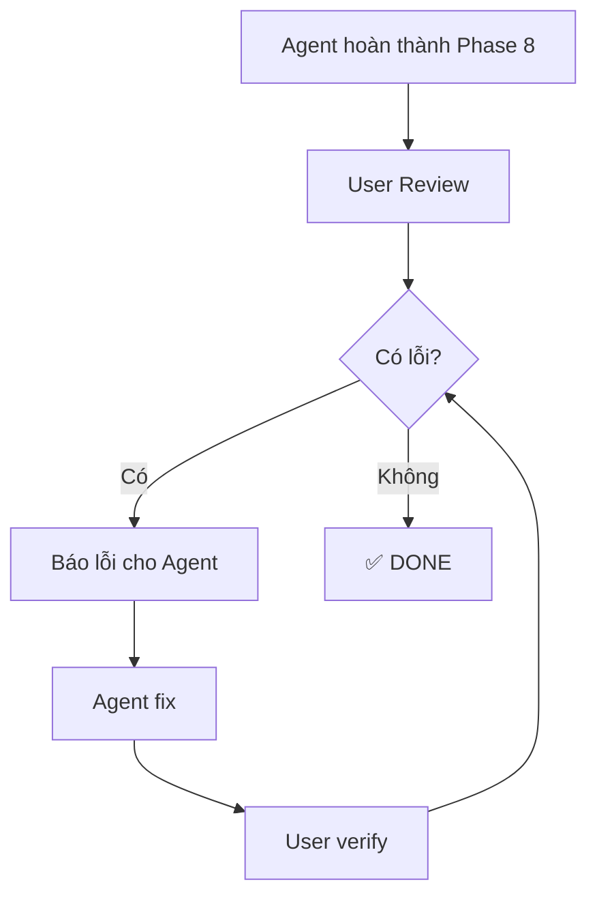

# Phase 9: User Review & Refinement

**Version**: 1.0.0
**Purpose**: Hướng dẫn quy trình review và tinh chỉnh kết quả phân tích

---

## Overview

Sau khi Agent hoàn thành Phase 0-8, User sẽ review kết quả và yêu cầu tinh chỉnh nếu cần. Đây là phase quan trọng để đảm bảo chất lượng output.



---

## Bước 1: Kiểm Tra Nhanh (5 phút)

### 1.1 Số liệu có khớp không?

**Check cross-reference:**
- `document/metrics.json` ↔ `document/insights.md` ↔ `charts/`
- Số liệu trong bảng phải khớp với text mô tả
- Tổng các phần phải bằng 100% (contribution)

**Cách check:**
```python
# Mở metrics.json
import json
with open('document/metrics.json') as f:
    metrics = json.load(f)

# So sánh với insights.md
# Nếu khác → BÁO LỖI
```

### 1.2 Biểu đồ có đúng không?

**Checklist:**
- [ ] Label có đọc được không?
- [ ] Scale có hợp lý không (không cắt cột)?
- [ ] Y-axis có bắt đầu từ 0 không (nếu là bar chart)?
- [ ] Màu sắc có nhất quán không?
- [ ] Title có mô tả đúng nội dung không?

### 1.3 Lập luận có logic không?

**Checklist:**
- [ ] Kết luận có dựa trên data không?
- [ ] Có contradiction nào không?
- [ ] Recommendations có actionable không?
- [ ] Có bỏ sót insight quan trọng không?

---

## Bước 2: Báo Lỗi Cho Agent

### Format báo lỗi chuẩn

```
LỖI PHÁT HIỆN:

1. [LOẠI LỖI]: [Mô tả ngắn]
   - Vị trí: [file:dòng hoặc chart name]
   - Giá trị sai: [X]
   - Giá trị đúng (nếu biết): [Y]
   - Ghi chú: [thêm context nếu cần]

2. [LOẠI LỖI]: [Mô tả ngắn]
   ...

YÊU CẦU:
- Fix lỗi [1, 2, ...]
- Giải thích nguyên nhân
- Cập nhật tất cả file liên quan
```

### Ví dụ thực tế

```
LỖI PHÁT HIỆN:

1. SAI SỐ LIỆU: Tổng contribution không bằng 100%
   - Vị trí: insights.md dòng 156
   - Giá trị sai: 36.7 + 27.6 + 14.8 + 12.1 + 8.2 = 99.4%
   - Giá trị đúng: Cần tính lại từ data gốc
   - Ghi chú: Có thể do làm tròn sai

2. BIỂU ĐỒ: Chart 03 bị cắt cột
   - Vị trí: charts/03_growth_rate_by_channel.png
   - Vấn đề: Y-axis bắt đầu từ 5% thay vì 0%
   - Giá trị đúng: Y-axis phải từ 0% để không misleading

3. LẬP LUẬN: Contradiction giữa các sections
   - Vị trí: insights.md section 4.2 vs 5.1
   - Vấn đề: Nói CHC rủi ro cao (CV 63%) nhưng khuyến nghị tăng đầu tư
   - Ghi chú: Cần giải thích logic hoặc sửa khuyến nghị

YÊU CẦU:
- Fix lỗi 1, 2, 3
- Cập nhật insights.md, metrics.json, và chart 03
- Giải thích logic khuyến nghị CHC
```

---

## Bước 3: Agent Xử Lý

Khi nhận được báo lỗi, Agent sẽ:

### 3.1 Xác nhận hiểu đúng

Agent trả lời:
```
Tao đã hiểu các lỗi:
1. Lỗi tính toán contribution - do làm tròn
2. Chart 03 scale sai - Y-axis không từ 0
3. Logic contradiction - cần clarify

Bắt đầu fix...
```

### 3.2 Truy nguồn gốc lỗi

- **Lỗi data**: Sai từ data gốc → cần check lại source
- **Lỗi tính toán**: Sai công thức → fix code
- **Lỗi logic**: Reasoning sai → sửa insights

### 3.3 Fix và cập nhật

Agent PHẢI:
- Fix tại nguồn (không patch)
- Cập nhật TẤT CẢ file liên quan
- Đảm bảo consistency sau khi fix

### 3.4 Báo cáo kết quả

Agent báo cáo:
```
ĐÃ FIX:

1. Số liệu contribution:
   - Nguyên nhân: Làm tròn 1 decimal thay vì 2
   - Fix: Tính lại với 2 decimals
   - Files updated: metrics.json, insights.md (dòng 156, 234, 567)

2. Chart 03:
   - Fix: Set ylim(0, max*1.1)
   - Files updated: code/analysis.py, charts/03_growth_rate.png

3. Logic CHC:
   - Giải thích: CHC rủi ro cao về biến động, nhưng ROI cao
   - Khuyến nghị: Tăng đầu tư KÈM theo hedge strategy
   - Files updated: insights.md (section 5.1)

Mày verify lại nhé.
```

---

## Bước 4: Verify Lại

User check:
1. Các điểm đã báo lỗi đã được fix chưa?
2. Consistency giữa các file sau khi fix?
3. Có lỗi mới phát sinh không?

Nếu còn lỗi → Lặp lại Bước 2

---

## Các Loại Lỗi Thường Gặp

| Loại Lỗi | Mô Tả | Cách Báo |
|----------|-------|----------|
| **SAI SỐ LIỆU** | Số không khớp giữa files | Chỉ rõ file, dòng, giá trị sai/đúng |
| **TÍNH TOÁN** | Cộng/trừ/nhân/chia sai | Chỉ ra phép tính và kết quả đúng |
| **BIỂU ĐỒ** | Scale sai, label sai, cắt cột | Chỉ rõ chart nào, vấn đề cụ thể |
| **LẬP LUẬN** | Logic không đúng, contradiction | Chỉ rõ 2 chỗ mâu thuẫn |
| **THIẾU** | Thiếu metric, thiếu chart | Yêu cầu bổ sung cụ thể |
| **THỪA** | Thông tin không cần thiết | Yêu cầu bỏ đi |
| **FORMAT** | Font sai, alignment sai | Chỉ rõ vị trí và cách sửa |

---

## Tips Kiểm Tra Hiệu Quả

### 1. Check cross-reference trước
- metrics.json ↔ insights.md ↔ charts
- Nếu 1 chỗ sai, khả năng cao các chỗ khác cũng sai

### 2. Ưu tiên fix theo thứ tự
1. **Số liệu sai** → Fix trước (ảnh hưởng cascade)
2. **Biểu đồ** → Fix sau
3. **Lập luận** → Fix cuối

### 3. Yêu cầu Agent giải thích
- "Tại sao giá trị này là X?"
- "Logic đưa ra khuyến nghị này là gì?"
- "Data nào support kết luận này?"
- Giúp phát hiện lỗi ẩn

### 4. Batch lỗi
- Thu thập TẤT CẢ lỗi trước khi báo
- Agent fix 1 lần thay vì nhiều lần
- Tiết kiệm thời gian và token

### 5. Verify cascade
Sau khi fix 1 lỗi, check các file liên quan:
- Fix metrics.json → Check insights.md có update không
- Fix chart → Check insights.md reference có đúng không

---

## Commands Hỗ Trợ

```bash
# Regenerate charts sau khi fix data
/analytics.charts all

# Regenerate chỉ business charts
/analytics.charts business

# Regenerate insights sau khi fix logic
/analytics.insights

# Check data quality
/analytics.check data.xlsx deep

# Regenerate EDA
/analytics.eda
```

---

## Workflow Integration

Phase 9 được tích hợp vào workflow chính:

```
Phase 0-8: Agent thực thi autonomous
    ↓
Phase 9: User Review & Refinement
    ↓
    ├── Không có lỗi → DONE
    └── Có lỗi → Báo lỗi → Agent fix → Verify → Loop
```

**Lưu ý**: Phase 9 có thể lặp nhiều lần cho đến khi User approve.

---

## Ví Dụ Session Hoàn Chỉnh

```
USER: [Sau khi nhận kết quả từ /analytics.run]

Tao đã review. Có vài lỗi:

LỖI PHÁT HIỆN:
1. SAI SỐ LIỆU: Revenue 2025 trong insights khác metrics.json
   - insights.md: 263.45 tỷ
   - metrics.json: 265.12 tỷ

2. BIỂU ĐỒ: Chart 01 không có đơn vị
   - Thiếu "tỷ VND" trên Y-axis

YÊU CẦU: Fix và sync tất cả

---

AGENT: Tao đã check:

1. Revenue 2025:
   - Nguyên nhân: metrics.json đã update nhưng insights chưa
   - Giá trị đúng: 265.12 tỷ (từ data gốc)
   - Fix: Update insights.md

2. Chart 01:
   - Fix: Thêm ylabel="Doanh thu (tỷ VND)"

Đang fix...

[Agent thực hiện fix]

ĐÃ FIX:
- insights.md: Cập nhật 263.45 → 265.12 (dòng 45, 123, 456)
- chart 01: Thêm Y-axis label

Mày verify lại nhé.

---

USER: OK, đã đúng. DONE.
```

---

**Ngày tạo**: 2025-11-21
**Mục đích**: Hướng dẫn quy trình review và tinh chỉnh kết quả phân tích
