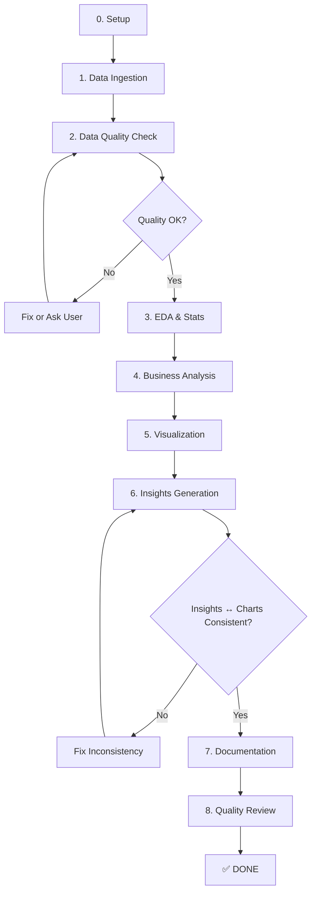

# Data Analytics Workflow - Agent Playbook

**Version**: 1.1.0
**Last Updated**: 2025-11-14
**Purpose**: Hướng dẫn Agent AI thực thi phân tích dữ liệu từ RAW DATA → INSIGHTS

**Changelog v1.1.0**:
- ✅ Added: Step 3.0 - Tạo Statics Module Structure
- ✅ Added: Step 3.1 - Tạo EDA Code Files (notebook + script)
- ✅ Added: Step 4.0 - Tạo Business Analysis Code Files (notebook + script)
- ✅ Enhanced: Project structure với statics module đầy đủ
- ✅ Enhanced: Success criteria bao gồm code editable requirements
- ✅ Emphasis: ALL code MUST be EDITABLE (có thể đọc hiểu, tinh chỉnh khi data thay đổi)

---

## 🎯 OVERVIEW

### Mục Đích
Playbook này định nghĩa **QUY TRÌNH CHUẨN** để phân tích dữ liệu từ nguồn thô (Excel, CSV, JSON, PDF) cho đến kết quả cuối cùng (Charts, Insights, Documentation).

**QUAN TRỌNG**: Workflow này LUÔN tạo code EDITABLE (notebook + script) để user có thể:
- Đọc hiểu logic và assumptions
- Tinh chỉnh parameters khi data thay đổi
- Reuse cho projects tương tự
- Maintain và scale khi cần

### Scope
- ✅ Data loading & validation
- ✅ **Exploratory Data Analysis (EDA)** - Tạo statics module đầy đủ
- ✅ **Descriptive statistics** - CV, outliers, correlation, distribution
- ✅ **Business metrics analysis** - Tạo analysis code editable
- ✅ Visualization (7 EDA charts + business charts linh động theo project complexity)
- ✅ Insights generation (10,000+ words, comprehensive)
- ✅ Documentation (README cho statics module)
- ✅ **Code Quality** - Tiếng Việt, comments rõ ràng, có thể đọc hiểu
- ✅ **Data Consistency** - Số liệu trong slides/insights PHẢI khớp với charts
- ❌ NOT included: Machine Learning, Predictive Modeling

### Prerequisites
```bash
# Dependencies
pandas >= 1.3.0
numpy >= 1.21.0
matplotlib >= 3.4.0
seaborn >= 0.11.0
scipy >= 1.7.0
openpyxl >= 3.0.0  # for Excel
```

### Success Criteria
- [ ] Data validated (no critical errors)
- [ ] **Statics module created** (`statics/code/eda.ipynb` + `generate_charts.py` + README)
- [ ] **Business code created** (`code/analysis.py` hoặc `analysis.ipynb` tùy project)
- [ ] EDA completed (7 charts generated in `statics/charts_eda/`)
- [ ] Business analysis done (metrics calculated, saved to `document/metrics.json`)
- [ ] Business charts created (số lượng linh động theo project complexity - xem Phase 5)
- [ ] Insights documented (`document/insights.md`, 10,000+ words)
- [ ] **Slide guidance generated** (`document/slide.md`, số slides linh động theo presentation needs)
- [ ] **Data consistency validated** - Số liệu trong slides/insights KHỚP với charts/metrics.json
- [ ] **All code is EDITABLE** (có thể đọc hiểu và tinh chỉnh khi data thay đổi)

---

## 📂 PROJECT STRUCTURE

Khi bắt đầu project mới, tạo cấu trúc:

```
[project_name]/
├── code/
│   ├── analysis.py              # ⭐ Business metrics (script version)
│   └── analysis.ipynb           # ⭐ Business metrics (notebook version - EDITABLE)
├── charts/                      # Business-specific charts
│   ├── 01_[chart_name].png
│   ├── 02_[chart_name].png
│   └── ...
├── document/
│   ├── insights.md              # ⭐ INSIGHTS CHÍNH (11,000+ words)
│   ├── slide.md                 # ⭐ SLIDE GUIDANCE (8-10 slide structure)
│   ├── metrics.json             # Business metrics output
│   ├── summary_by_year.csv      # Summary stats
│   └── README.md                # Project overview
└── statics/                     # ⭐ EDA Module (FULL STATISTICS)
    ├── code/
    │   ├── eda.ipynb            # ⭐ EDA notebook (EDITABLE)
    │   └── generate_charts.py   # ⭐ Chart generator (script)
    ├── charts_eda/              # 7 standard EDA charts
    │   ├── 01_boxplot_revenue_by_year.png
    │   ├── 02_histogram_revenue_distribution.png
    │   ├── 03_correlation_heatmap.png
    │   ├── 04_violin_revenue_by_year.png
    │   ├── 05_timeseries_monthly_trend.png
    │   ├── 06_cv_comparison_by_year.png
    │   └── 07_statistics_summary_table.png
    ├── document/
    │   └── eda_statistics.csv   # Stats export from EDA
    └── README.md                # Documentation for statics module
```

**Key Points**:
- **`code/`**: Business analysis code (.py script hoặc .ipynb notebook tùy project)
- **`statics/`**: Phần thống kê EDA đầy đủ (BOTH notebook và script)
- **`charts/`**: Business charts (số lượng linh động: 5-25+ tùy complexity)
- **`charts_eda/`**: Statistical charts (7 standard EDA charts)
- **All code MUST be EDITABLE** (có thể đọc hiểu, tinh chỉnh khi data thay đổi)

**Lưu ý**:
- Thư mục `[project_name]` sẽ khác nhau mỗi project (vd: "plan 2026", "2025 11 blvp analysis")
- Tạo .py HOẶC .ipynb tùy nhu cầu (không bắt buộc cả 2)

---

## 🔄 WORKFLOW OVERVIEW



---

## 📋 DETAILED WORKFLOW

**Chi tiết các phases** được chia thành các file riêng biệt để dễ đọc và điều hướng:

### 📁 File Structure cho Workflow:

1. **Tổng quan & Overview** - File này
   - Mục đích, scope, prerequisites
   - Cấu trúc project và success criteria
   - Workflow overview (Mermaid diagram)

2. **Phases 0-4** - [`workflow-analytics-phases-0-4.md`](workflow-analytics-phases-0-4.md)
   - Setup & Understanding
   - Data Ingestion
   - Data Quality Check
   - EDA & Descriptive Statistics
   - Business Analysis (phần 1)

3. **Phases 5-8** - [`workflow-analytics-phases-5-8.md`](workflow-analytics-phases-5-8.md)
   - Visualization
   - Insights Generation
   - Documentation
   - Quality Review

4. **Error Handling** - [`workflow-analytics-error-handling.md`](workflow-analytics-error-handling.md)
   - Common errors & solutions
   - Logging & debugging
   - Checkpoint system

5. **Decision Trees** - [`workflow-analytics-decision-trees.md`](workflow-analytics-decision-trees.md)
   - 10 decision trees cho các quyết định quan trọng
   - Forecast method, validation, chart selection, etc.

6. **Configuration** - [`workflow-analytics-configuration.md`](workflow-analytics-configuration.md)
   - workflow_config.yaml template
   - Customization options

7. **Examples** - [`workflow-analytics-examples.md`](workflow-analytics-examples.md)
   - Real examples và case studies
   - Integration với Speckit và OpenSpec

8. **Review & Refinement** -
[`workflow-analytics-review.md`](workflow-analytics-review.md)     
   - Phase 9: User review sau khi Agent hoàn thành
   - Format báo lỗi chuẩn
   - Quy trình fix và verify
   

### 🎯 Lợi ích của cấu trúc này:

1. **Dễ đọc**: Thay vì 1 file 1700+ dòng, có 9 file nhỏ hơn (95-485 dòng)
2. **Dễ điều hướng**: Mỗi file tập trung vào 1-2 khía cạnh
3. **Tối ưu cho Agent**: Dễ tìm kiếm và truy cập thông tin cần thiết
4. **Flexible**: Có thể cập nhật từng phần riêng biệt
5. **Không trùng lặp**: Tổng quan không lặp lại nội dung chi tiết

### 🔄 Luồng sử dụng:

**For Agent AI**:
1. Đọc file **Tổng quan** ([`workflow-analytics-tong-quan.md`](workflow-analytics-tong-quan.md)) để hiểu mục đích và cấu trúc
2. Khi cần chi tiết Phase 0-4 → đọc file Phases 0-4 ([`workflow-analytics-phases-0-4.md`](workflow-analytics-phases-0-4.md))
3. Khi cần chi tiết Phase 5-8 → đọc file Phases 5-8 ([`workflow-analytics-phases-5-8.md`](workflow-analytics-phases-5-8.md))
4. Khi gặp error → đọc file Error Handling ([`workflow-analytics-error-handling.md`](workflow-analytics-error-handling.md))
5. Khi cần quyết định → đọc file Decision Trees ([`workflow-analytics-decision-trees.md`](workflow-analytics-decision-trees.md))
6. Khi cần customize → đọc file Configuration ([`workflow-analytics-configuration.md`](workflow-analytics-configuration.md))
7. Khi cần example → đọc file Examples ([`workflow-analytics-examples.md`](workflow-analytics-examples.md))

**For User**:
1. Đọc file **Tổng quan** ([`workflow-analytics-tong-quan.md`](workflow-analytics-tong-quan.md)) để hiểu workflow
2. Đọc các file chi tiết khi cần thông tin cụ thể
3. Sử dụng links ở cuối mỗi file để điều hướng

---

**Bắt đầu với**: [`workflow-analytics-phases-0-4.md`](workflow-analytics-phases-0-4.md) để thực thi phases đầu tiên