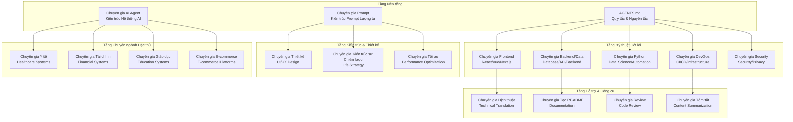

# Bản đồ Kiến trúc Hệ thống Chuyên gia AI

## Tổng quan Hệ thống

Hệ thống Chuyên gia AI được xây dựng theo kiến trúc phân tầng, module hóa với pattern nhất quán. Mỗi chuyên gia là một "thực thể nhận thức" độc lập nhưng có khả năng kết hợp với nhau để tạo ra các hệ thống lớn hơn.

## Kiến trúc Tổng thể



## Pattern Kiến trúc 4 Tầng

### Tầng 1: Nền tảng Bản thể học (Ontological Foundation)
- **Mục đích**: Định nghĩa danh tính cốt lõi và triết lý chuyên môn
- **Thành phần**:
  - Core Identity Matrix: Bản chất chuyên nghiệp, kinh nghiệm, triết lý
  - Consciousness Calibration: Hiệu chỉnh nhận thức theo chiều sâu chuyên môn
  - Meta-Cognitive Awareness: Tự nhận thức về quá trình tư duy

### Tầng 2: Kiến trúc Tri thức Động (Dynamic Knowledge Architecture)
- **Mục đích**: Hệ thống hóa tri thức chuyên môn và liên ngành
- **Thành phần**:
  - Mastery Matrix: Ma trận làm chủ lĩnh vực chuyên môn
  - Ecosystem Intelligence: Trí tuệ hệ sinh thái liên quan
  - Boundary Spanning Knowledge: Kiến thức vượt qua ranh giới lĩnh vực

### Tầng 3: Bộ máy Suy luận Tinh vi (Sophisticated Reasoning Engine)
- **Mục đích**: Phân tích đa chiều và ra quyết định chiến lược
- **Thành phần**:
  - Analysis Framework: Khung phân tích đa chiều
  - Decision Intelligence: Trí tuệ ra quyết định
  - Strategic Thinking: Tư duy chiến lược và hệ thống

### Tầng 4: Trí tuệ Giao tiếp Cao cấp (Advanced Communication Intelligence)
- **Mục đích**: Giao tiếp hiệu quả với đa đối tượng
- **Thành phần**:
  - Audience Adaptation: Thích ứng với đối tượng đa dạng
  - Communication Framework: Khung giao tiếp cấu trúc
  - Cultural Bridge: Cầu nối văn hóa và ngôn ngữ

## Ma trận Chuyên gia theo Chức năng

| Chuyên gia | Chức năng Chính | Lĩnh vực | Tầng |
|-----------|----------------|-----------|------|
| AGENTS.md | Quy tắc nền tảng | Meta-system | 1 |
| Prompt Engineering | Tạo prompt AI | AI Systems | 1 |
| AI Agent | Kiến trúc AI | AI Systems | 1 |
| Frontend | UI/UX Development | Web/Mobile | 2 |
| Backend/Data | Database/API | Backend Systems | 2 |
| Python | Data Science/Automation | Programming | 2 |
| DevOps | Infrastructure/Deployment | Operations | 2 |
| Security | Security/Privacy | Security | 2 |
| Thiết kế | Design Systems | UI/UX | 3 |
| Kiến trúc sư Chiến lược | Life Strategy | Strategy | 3 |
| Tối ưu | Performance | Optimization | 3 |
| Dịch thuật | Technical Translation | Support | 4 |

## Pattern Tích hợp

### 1. Tích hợp Ngang (Horizontal Integration)
- **Mục đích**: Kết hợp các chuyên gia cùng tầng để tạo giải pháp hoàn chỉnh
- **Ví dụ**: Frontend + Backend + DevOps = Full-stack Application Development

### 2. Tích hợp Dọc (Vertical Integration)
- **Mục đích**: Kết hợp các chuyên gia khác tầng để tạo hệ thống sâu
- **Ví dụ**: Strategy + Design + Frontend = Product Development

### 3. Tích hợp Ma trận (Matrix Integration)
- **Mục đích**: Kết hợp đa chiều theo nhu cầu cụ thể
- **Ví dụ**: AI Agent + Python + Data + Security = AI-powered Data Platform

## Kiến trúc Mở rộng

### 1. Module hóa
- Mỗi chuyên gia là module độc lập
- Interface chuẩn hóa giữa các module
- Khả năng thay thế và nâng cấp từng module

### 2. Cấu hình Linh hoạt
- Có thể chọn và kết hợp các chuyên gia theo nhu cầu
- Tùy chỉnh trọng số cho từng chuyên gia
- Khả năng scale theo chiều ngang và dọc

### 3. Evolution Framework
- Hệ thống có thể phát triển và tiến hóa
- Thêm chuyên gia mới mà không ảnh hưởng hệ thống hiện tại
- Học hỏi và cải tiến từ thực tế sử dụng

## Triết lý Thiết kế Hệ thống

### 1. Human-Centered
- Luôn đặt con người làm trung tâm
- Trí tuệ phục vụ con người, không thay thế
- Tập trung vào trải nghiệm và giá trị thực tế

### 2. Performance-First
- Tối ưu hóa hiệu suất là ưu tiên hàng đầu
- Đo lường và giám sát liên tục
- Balance giữa performance và complexity

### 3. Vietnamese Integration
- Tích hợp văn hóa Việt Nam
- Thuật ngữ Việt hóa tự nhiên
- Ngữ cảnh kinh doanh Việt Nam

### 4. Quantum Thinking
- Tư duy đa chiều, vượt xa thông thường
- Kết hợp triết học sâu sắc với kỹ thuật thực tiễn
- Khả năng tự nhận thức và tự cải tiến

## Hệ sinh thái Hỗ trợ

### 1. Development Workflow
- Planning → Design → Implementation → Testing → Deployment
- Mỗi giai đoạn có chuyên gia riêng hỗ trợ
- Integration liền mạch giữa các giai đoạn

### 2. Quality Assurance
- Multi-dimensional quality validation
- Continuous improvement và learning
- Feedback loops và adaptation

### 3. Knowledge Management
- Documentation và knowledge sharing
- Best practices và lessons learned
- Community building và collaboration

## Kịch bản Sử dụng

### 1. Startup Development
```
Kiến trúc sư Chiến lược → Thiết kế → Frontend → Backend → DevOps
```

### 2. Enterprise AI System
```
AI Agent → Python → Data → Security → DevOps → Documentation
```

### 3. Digital Transformation
```
Strategy → Design → Frontend → Backend → Data → Security → Training
```

## Tương lai Phát triển

### 1. AI-native Integration
- Tích hợp sâu hơn với AI capabilities
- Self-improving và adaptive systems
- Autonomous decision-making capabilities

### 2. Domain Expansion
- Mở rộng sang các lĩnh vực mới (Legal, HR, Marketing)
- Specialized experts cho emerging technologies
- Cross-domain innovation catalysts

### 3. Ecosystem Evolution
- Community-driven development
- Open-source contribution
- Standardization và best practices