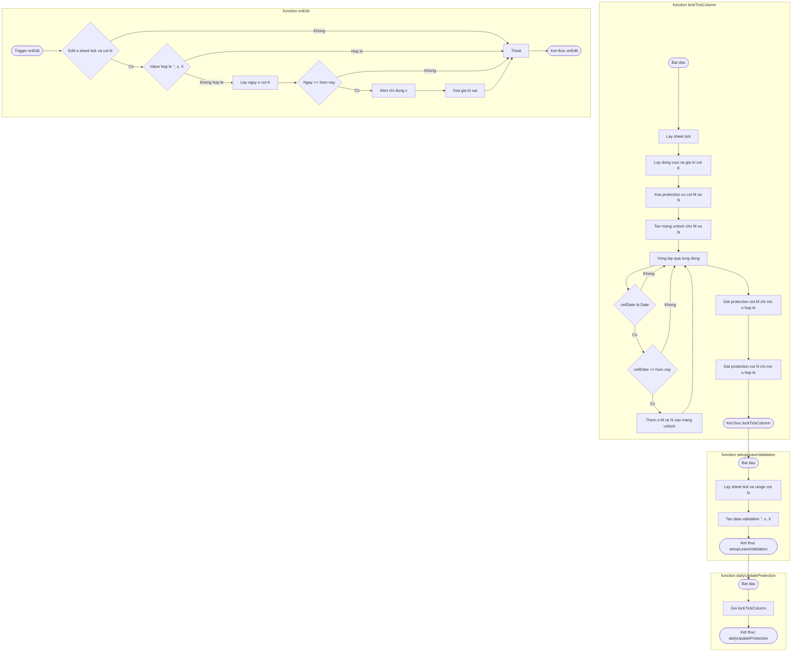

# SAFE-FLOW AGENT — HTML Mermaid Generator (Phiên bản HTML)

## Mục tiêu
Tạo một **Agent** (Safe-Flow Agent) cập nhật để **xuất sơ đồ Mermaid nhúng trong file HTML** thay vì chỉ xuất block `mermaid`. Mục tiêu: khi mày paste code vào Agent, nó sẽ trả về:
1. Một **block Mermaid an toàn** (đã sanitize) để dán nhanh vào mermaid.live.
2. Một **file HTML hoàn chỉnh** (sẵn để mở trên trình duyệt) — Agent sẽ chèn Mermaid code vào template này, không lỗi parse, render thẳng.

Tao đã chỉnh agent theo logic sau — **đảm bảo 100% không trả ra Mermaid parse error** do ký tự đặc biệt hoặc nhãn dài.

---

## Nguyên tắc chính (bắt buộc)
1. **Sanitize nhãn node**:
   - Loại bỏ ký tự: `"` `'` `:` `(` `)` < `>` `` ` ``.
   - Thay `&` bằng ` va `.
   - Rút gọn liên tiếp khoảng trắng thành một khoảng trắng.
   - Giới hạn độ dài nhãn (ví dụ 120 ký tự).  
   - Nếu cần xuống dòng, dùng `\n`.

2. **Không nối nhiều node cùng lúc** (không dùng `I & J --> End`). Thay bằng nối từng node về End:
   ```
   I --> End
   J --> End
   ```

3. **Node label chỉ chứa chữ, số, dấu cách, dấu gạch ngang, dấu gạch dưới, dấu xuống dòng `\n`**. Tiếng Việt có dấu được phép nhưng tránh các ký tự đặc biệt ở trên.

4. **Mỗi hàm → một `subgraph`**. Tên subgraph lấy từ tên hàm đã sanitize.

5. **Call graph**: Agent sẽ nối `End` của hàm gọi → `Start` của hàm được gọi để thể hiện luồng gọi hàm.

---

## Cấu trúc Agent (quy trình)
1. **Nhận input**: code snippet (multi-function hoặc single-function).
2. **Phân tích**:
   - Phát hiện tên hàm, body, các câu lệnh gọi hàm.
   - Phân tách thành các bước (khởi tạo, lấy dữ liệu, vòng lặp, điều kiện, đặt protection, return).
3. **Sinh nodes** (mỗi bước → 1 node) và các diamond nodes cho điều kiện.
4. **Sanitize** tất cả nhãn node theo luật ở trên.
5. **Tạo subgraph cho từng hàm**; bên ngoài nối call graph.
6. **Xuất 2 artifact**:
   - `mermaid` block (đã sanitize) — để copy dán nhanh.
   - `index.html` template — file HTML hoàn chỉnh có mermaid.js CDN và mermaid code chèn sẵn.

---

## Template HTML mẫu (Agent sẽ xuất file này, chèn diagram vào chỗ `<!-- MERMAID_DIAGRAM -->`)
```html
<!doctype html>
<html lang="vi">
<head>
  <meta charset="utf-8" />
  <meta name="viewport" content="width=device-width,initial-scale=1" />
  <title>Safe-Flow Diagram</title>
  <script src="https://cdn.jsdelivr.net/npm/mermaid/dist/mermaid.min.js"></script>
  <style>
    body { font-family: system-ui, Arial, sans-serif; margin: 24px; background:#fff; color:#111; }
    header { margin-bottom: 12px; }
    .diagram-container { border: 1px solid #e5e7eb; padding: 12px; border-radius:8px; box-shadow: 0 1px 2px rgba(0,0,0,0.03); }
    .info { margin-bottom: 10px; color:#374151; font-size:14px; }
    .controls { margin-top: 12px; }
    button { padding:8px 12px; border-radius:6px; border:1px solid #d1d5db; background:#f9fafb; cursor:pointer; }
  </style>
</head>
<body>
  <header>
    <h2>Safe-Flow Diagram (Mermaid HTML)</h2>
    <div class="info">Mở file này trong trình duyệt để xem sơ đồ. File được sinh tự động bởi Safe-Flow Agent (đã sanitize labels).</div>
  </header>

  <div class="diagram-container">
    <!-- MERMAID_DIAGRAM -->
    <div class="mermaid">
flowchart TD
    Start([Bắt dau]) --> End([Ket thuc])
    </div>
  </div>

  <script>
    // khởi tạo mermaid
    if (typeof mermaid !== 'undefined') {
      mermaid.initialize({ startOnLoad: true, theme: 'default' });
    }

  </script>
</body>
</html>
```

---

## Hàm sanitize mẫu (Agent dùng trước khi chèn vào HTML)
Agent **PHẢI** gọi hàm này để đảm bảo không lỗi parse Mermaid:

```js
function sanitizeLabel(label) {
  if (!label) return '';
  // loại bỏ ký tự gây lỗi
  label = label.replace(/["'`:<>\\`]/g, '');
  // thay & bằng ' va '
  label = label.replace(/&/g, ' va ');
  // loại bỏ ngoặc (những dạng tròn vuông)
  label = label.replace(/[\(\)\[\]\{\}]/g, ' ');
  // collapse multi spaces
  label = label.replace(/\s+/g, ' ').trim();
  // limit length
  if (label.length > 120) label = label.slice(0, 120) + '...';
  return label;
}
```

---

## Ví dụ áp dụng (code của mày)
Agent sẽ sinh block Mermaid an toàn và file HTML tương ứng. Ví dụ diagram đã sanitize cho hàm `lockTickColumn` và các hàm liên quan:

**Mermaid block an toàn (để paste nhanh vào mermaid.live):**


**HTML file**: Agent sẽ chèn block Mermaid ở vị trí `<!-- MERMAID_DIAGRAM -->` trong template HTML phía trên. Lưu file HTML và mở trình duyệt để xem.

---

## Output mà Agent trả về (quy chuẩn)
1. **mermaid_block**: string (đã sanitize) — copy dán nhanh.  
2. **html_file_content**: string (complete HTML) — ghi ra `diagram.html` và tải về/open.  
3. **explain_text**: tiếng Việt ngắn gọn mô tả sơ đồ, các hàm và cạm bẫy cần chú ý.

---

## Hướng dẫn cài đặt / sử dụng
1. Paste code vào Agent (định dạng plain text).  
2. Agent parse → generate mermaid_block + html_file_content + explain_text.  
3. Mày lưu `html_file_content` vào `diagram.html` rồi mở bằng trình duyệt.  
4. Muốn image: dùng nút "Tải SVG" hoặc "Tải PNG" trên trang.

---

## Ghi chú kỹ thuật
- Agent phải luôn chạy `sanitizeLabel` trên mọi label.  
- Nếu code quá nhiều node (>200), Agent sẽ tự chia thành nhiều trang/diagram để giữ readability.  
- Agent phải trả về both mermaid block và HTML content mỗi lần.

---

## File markdown này
Tao đã đóng gói Safe-Flow Agent (phiên bản HTML) trong file này để mày lưu làm reference và drop vào thư mục chuyên gia của mày.
