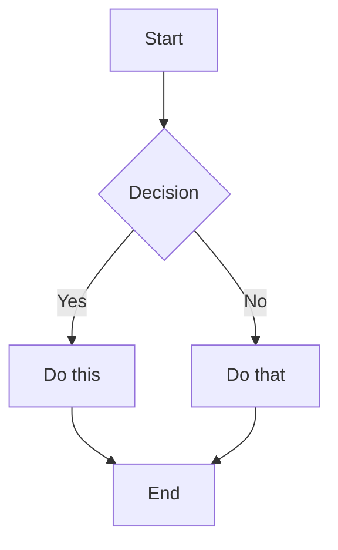
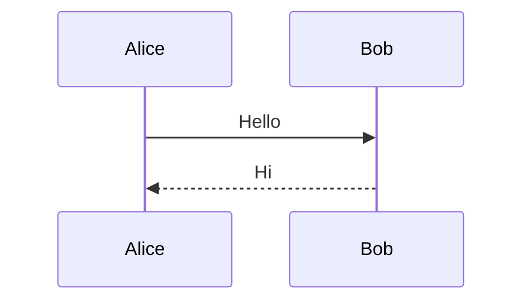
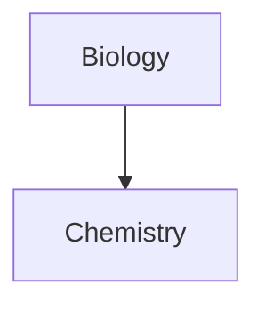
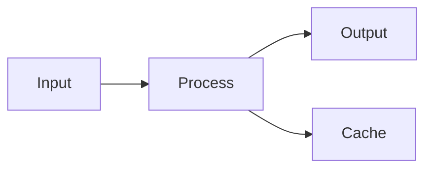

# Skill Obsidian Markdown

Skill này tạo và sửa Obsidian Flavored Markdown, bao gồm tất cả các syntax mở rộng của Obsidian.

## Nguyên tắc

1. **Tối giản** - Không thêm emoji, không icon, không decoration dư thừa
2. **Tiếng Việt** - Nội dung dùng tiếng Việt, thuật ngữ kỹ thuật giữ tiếng Anh
3. **Logic** - Cấu trúc rõ ràng, dễ đọc, dễ maintain
4. **Tinh tế** - Đúng syntax, không lạm dụng tính năng
5. **Rõ ràng** - Tên file, heading, nội dung phải unambiguous

## Obsidian Markdown Flavors

Obsidian kết hợp:
- [CommonMark](https://commonmark.org/)
- [GitHub Flavored Markdown](https://github.github.com/gfm/)
- [LaTeX](https://www.latex-project.org/) cho math
- Obsidian extensions: wikilinks, callouts, embeds, properties, tags

## Syntax cơ bản

### Paragraphs và line breaks

```markdown
Paragraph 1.

Paragraph 2 (dòng trắng giữa paragraphs).

Line break trong paragraph: add 2 spaces at end
hoặc Shift+Enter.
```

### Headings

```markdown
# Heading 1
## Heading 2
### Heading 3
```

### Text formatting

| Style | Syntax | Output |
|-------|--------|--------|
| Bold | `**text**` | **Bold** |
| Italic | `*text*` | *Italic* |
| Bold + Italic | `***text***` | ***Both*** |
| Strikethrough | `~~text~~` | ~~Striked~~ |
| Highlight | `==text==` | ==Highlighted== |
| Inline code | `` `code` `` | `code` |

### Escape special characters

```markdown
\*Not italic*
\#Not heading
1\. Not list item
```

Characters cần escape: `\*`, `\_`, `\#`, `` \` ``, `\|`, `\~`

---

## Wikilinks (Internal Links)

### Basic

```markdown
[[Note Name]]
[[Note Name.md]]
[[Note Name|Display Text]]
```

### Link đến headings

```markdown
[[Note Name#Heading]]
[[Note Name#Heading|Custom Text]]
[[#Heading in same note]]
[[##Search all headings in vault]]
```

### Link đến blocks

```markdown
[[Note Name#^block-id]]
[[Note Name#^block-id|Custom Text]]
```

Định nghĩa block ID:

```markdown
This is a paragraph. ^my-block-id

> Quote with multiple lines
^quote-id
```

### Search links

```markdown
[[##heading]]     Search headings containing "heading"
[[^^block]]       Search blocks containing "block"
```

---

## Embeds

### Notes

```markdown
![[Note Name]]
![[Note Name#Heading]]
![[Note Name#^block-id]]
```

### Images

```markdown
![[image.png]]
![[image.png|640x480]]    Width x Height
![[image.png|300]]        Width only (maintain aspect ratio)
```

### External images

```markdown


```

### Audio

```markdown
![[audio.mp3]]
![[audio.ogg]]
```

### PDF

```markdown
![[document.pdf]]
![[document.pdf#page=3]]
![[document.pdf#height=400]]
```

### Lists

```markdown
![[Note#^list-id]]
```

Định nghĩa list ID:

```markdown
- Item 1
- Item 2
- Item 3

^list-id
```

### Embed search results

````markdown
```query
tag:#project status:done
```
````

---

## Callouts

### Basic

```markdown
> [!note]
> Content here.

> [!info] Custom Title
> Content with custom title.

> [!tip]- Collapsed by default
> Hidden until expanded.

> [!tip]+ Expanded by default
> Visible but collapsible.
```

### Nested

```markdown
> [!question] Outer
> > [!note] Inner
> > Nested content
```

### Types

| Type | Màu | Dùng khi |
|------|-----|----------|
| `note` | Xanh | Note chung |
| `info` | Xanh | Thông tin |
| `tip` / `hint` | Cyan | Gợi ý |
| `success` / `check` | Xanh lá | Hoàn thành |
| `question` / `help` / `faq` | Vàng | Câu hỏi |
| `warning` / `caution` | Cam | Cảnh báo |
| `failure` / `danger` | Đỏ | Lỗi, nguy hiểm |
| `bug` | Đỏ | Bug |
| `example` | Tím | Ví dụ |
| `quote` | Xám | Trích dẫn |

### Custom callouts (CSS)

```css
.callout[data-callout="custom-type"] {
  --callout-color: 255, 0, 0;
  --callout-icon: lucide-alert-circle;
}
```

---

## Lists

### Unordered

```markdown
- Item 1
- Item 2
  - Nested
  - Another nested
- Item 3

* Dùng * hoặc + cũng được
```

### Ordered

```markdown
1. First
2. Second
   1. Nested
   2. Another nested
3. Third
```

### Task lists

```markdown
- [ ] Incomplete
- [x] Completed
- [ ] Parent
  - [ ] Subtask 1
  - [x] Subtask 2
```

---

## Quotes

```markdown
> Blockquote.
> Multiple lines.
>
> Multiple paragraphs.
>
> > Nested quotes.
```

---

## Code

### Inline

```markdown
Use `backticks` for inline code.
Use double backticks for ``code with ` backtick inside``.
```

### Code blocks

````markdown
```
Plain code block
```

```javascript
// Syntax highlighted
function hello() {
  console.log("Hello");
}
```
````

### Nesting code blocks

`````markdown
````markdown
Code block inside:
```js
console.log("Hello")
```
````
`````

---

## Tables

### Basic

```markdown
| Header 1 | Header 2 | Header 3 |
|----------|----------|----------|
| Cell 1   | Cell 2   | Cell 3   |
```

### Alignment

```markdown
| Left     | Center   | Right    |
|:---------|:--------:|---------:|
| Left     | Center   | Right    |
```

### Escape pipes

```markdown
| Column 1 | Column 2 |
|----------|----------|
| [[Link\|Display]] | ![[Image\|100]] |
```

---

## Math (LaTeX)

### Inline

```markdown
Inline math: $e^{i\pi} + 1 = 0$
```

### Block

```markdown
$$
\begin{vmatrix}
a & b \\
c & d
\end{vmatrix} = ad - bc
$$
```

### Common syntax

```markdown
$x^2$              Superscript
$x_i$              Subscript
$\frac{a}{b}$      Fraction
$\sqrt{x}$         Square root
$\sum_{i=1}^{n}$   Sum
$\int_a^b$         Integral
$\alpha, \beta$    Greek letters
```

---

## Diagrams (Mermaid)

````markdown

````

### Sequence diagrams

````markdown

````

### Linking trong diagrams

````markdown

````

---

## Footnotes

```markdown
Sentence with footnote[^1].

[^1]: Footnote content here.

Named footnotes[^note].

[^note]: Named footnotes appear as numbers.

Inline footnotes.^[This is inline.]
```

---

## Comments

```markdown
Visible %%but this is hidden%% text.

%%
Entire hidden block.
Won't appear in reading view.
%%
```

---

## Horizontal Rules

```markdown
---
***
___
```

---

## Properties (Frontmatter)

YAML frontmatter ở đầu note:

```yaml
---
title: My Note Title
date: 2024-01-15
tags:
  - project
  - important
aliases:
  - My Note
  - Alternative Name
cssclasses:
  - custom-class
status: in-progress
rating: 4.5
completed: false
due: 2024-02-01T14:30:00
---
```

### Property types

| Type | Example |
|------|---------|
| Text | `title: My Title` |
| Number | `rating: 4.5` |
| Checkbox | `completed: true` |
| Date | `date: 2024-01-15` |
| Date & Time | `due: 2024-01-15T14:30:00` |
| List | `tags: [one, two]` hoặc YAML list |
| Links | `related: "[[Other Note]]"` |

### Default properties

- `tags` - Note tags
- `aliases` - Alternative names
- `cssclasses` - CSS classes cho note

---

## Tags

```markdown
#tag
#nested/tag
#tag-with-dashes
#tag_with_underscores

Trong frontmatter:
---
tags:
  - tag1
  - nested/tag2
---
```

Tags có thể chứa:
- Chữ cái (bất kỳ ngôn ngữ)
- Số (không được đầu tiên)
- Underscores `_`
- Hyphens `-`
- Forward slashes `/` (cho nesting)

---

## HTML Content

Obsidian hỗ trợ HTML trong Markdown:

```markdown
<div class="custom-container">
  <span style="color: red;">Red text</span>
</div>

<details>
  <summary>Click to expand</summary>
  Hidden content.
</details>

<kbd>Ctrl</kbd> + <kbd>C</kbd>
```

---

## Example hoàn chỉnh

````markdown
---
title: Project Alpha
date: 2024-01-15
tags:
  - project
  - active
status: in-progress
priority: high
---

# Project Alpha

## Overview

Project này aims to [[improve workflow]].

> [!important] Key Deadline
> Milestone 1 due on ==January 30th==.

## Tasks

- [x] Initial planning
- [x] Resource allocation
- [ ] Development phase
  - [ ] Backend
  - [ ] Frontend
- [ ] Testing
- [ ] Deployment

## Technical Notes

Algorithm uses $O(n \log n)$ for sorting.

```python
def process_data(items):
    return sorted(items, key=lambda x: x.priority)
```

## Architecture



## Related

- ![[Meeting Notes 2024-01-10#Decisions]]
- [[Budget Allocation|Budget]]
- [[Team Members]]

## References

See documentation[^1].

[^1]: https://example.com/docs

%%
Internal notes:
- Review with team Friday
- Consider alternatives
%%
````

---

## References

- [Basic formatting](https://help.obsidian.md/syntax)
- [Advanced formatting](https://help.obsidian.md/advanced-syntax)
- [Obsidian Flavored Markdown](https://help.obsidian.md/obsidian-flavored-markdown)
- [Internal links](https://help.obsidian.md/links)
- [Embed files](https://help.obsidian.md/embeds)
- [Callouts](https://help.obsidian.md/callouts)
- [Properties](https://help.obsidian.md/properties)
